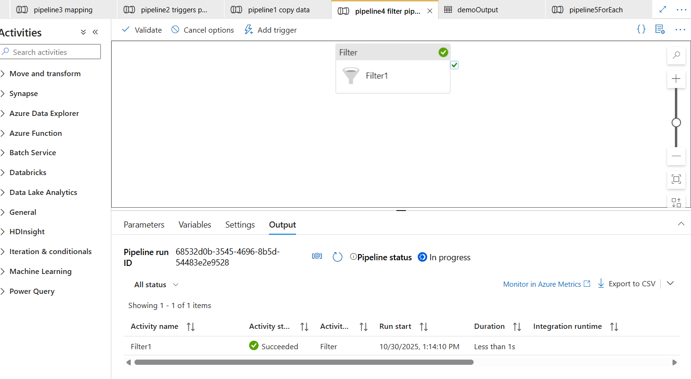
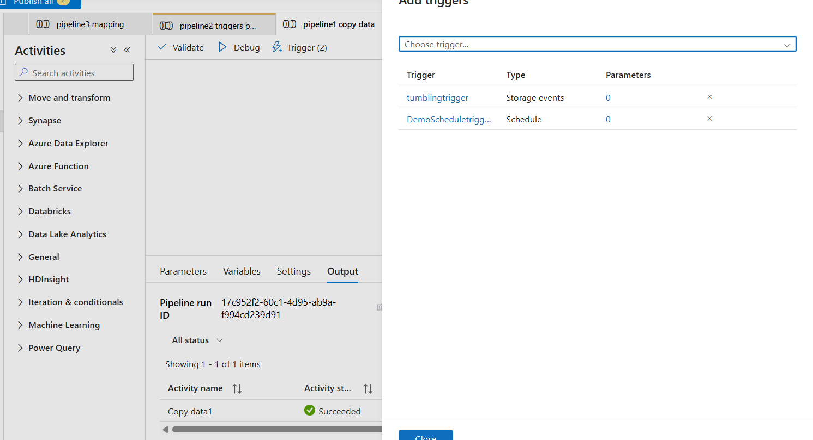

# Azure Cloud Projects 🚀

This repository showcases my hands-on experience with **Microsoft Azure**, focusing on **data engineering**, **cloud automation**, and **AI-based solutions**.  
All projects are designed with **real-world cloud use cases** and industry best practices.

---

## 🔧 Technologies Used
- Azure Data Factory  
- Azure Blob Storage  
- Azure Triggers (Schedule & Tumbling Window)  
- Azure Integration Runtime  
- Azure AI Custom Vision  

---

## 📂 Project Structure

azure-cloud/
│
├── Azure-Data-Factory/
│   ├── copy-activity/
│   │   ├── pipeline-copy-blob-to-blob.json
│   │   ├── screenshots/
│   │   └── README.md
│   │
│   ├── filter-activity/
│   │   ├── pipeline-filter-files.json
│   │   ├── screenshots/
│   │   └── README.md
│   │
│   ├── foreach-activity/
│   │   ├── pipeline-foreach-copy.json
│   │   ├── screenshots/
│   │   └── README.md
│   │
│   └── triggers/
│       ├── schedule-trigger.json
│       ├── tumbling-window-trigger.json
│       └── README.md
│
├── Azure-Storage/
│   ├── blob-storage-automation.md
│   └── screenshots/
│
├── Azure-AI-Custom-Vision/
│   ├── dataset/
│   ├── training-steps.md
│   ├── performance-metrics.md
│   └── screenshots/
│
├── Architecture-Diagrams/
│   └── end-to-end-architecture.png
│
└── LICENSE

---

## 📌 Projects Overview

### 1️⃣ Azure Data Factory Pipelines
- Copy activity between Blob Storage accounts  
- Filter activity to process selective files  
- ForEach activity for batch file processing  
- Trigger-based automation (schedule & tumbling window)

### 2️⃣ Azure Storage Automation
- Secure blob-to-blob data transfer  
- Event-driven pipeline execution  

### 3️⃣ Azure AI Custom Vision
- Image classification using Custom Vision  
- Model training (Quick & Advanced)  
- Performance evaluation using Precision, Recall & AP  

---

## 📊 Key Highlights
- Designed end-to-end cloud data pipelines  
- Implemented automation using Azure triggers  
- Achieved **100% Precision & Recall** in AI model testing  
- Followed real-world cloud architecture standards  

---

## 📎 Architecture
Refer to **Architecture-Diagrams/** for complete workflow diagrams.

---

## 📸 Screenshots
Each project folder includes screenshots showing:
- Successful pipeline runs  
- Trigger execution  
- AI model training & results

- ## 📸 Screenshots
## 📸 Screenshots

### Azure Data Factory – Copy Activity

### Filter Activity Output

### ForEach Pipeline Execution

 ### Triggers

---
📸 Internship Screenshots
Azure Portal Dashboard

🔹 Data Factory Pipeline Execution

Successful Deployment / Output

## 🔗 Connect With Me
**LinkedIn:** https://www.linkedin.com/in/your-linkedin-username  
**GitHub:** https://github.com/PRANAYKHOJARE

---

⭐ If you find this repository useful, consider giving it a star!
